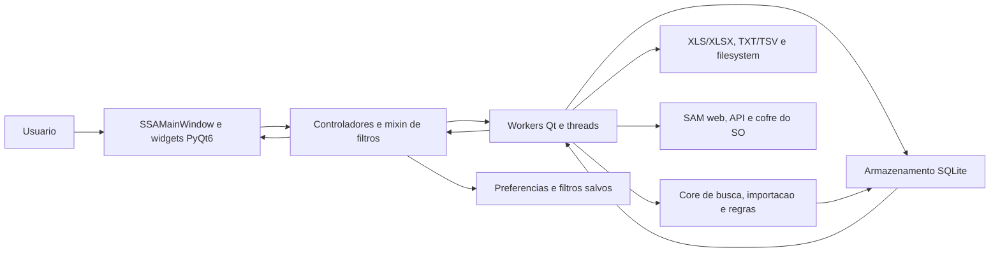
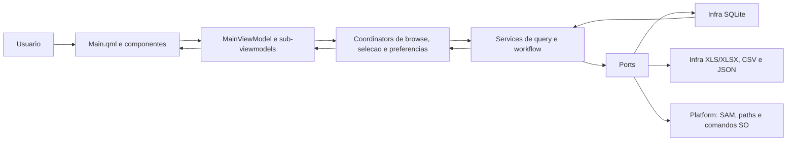
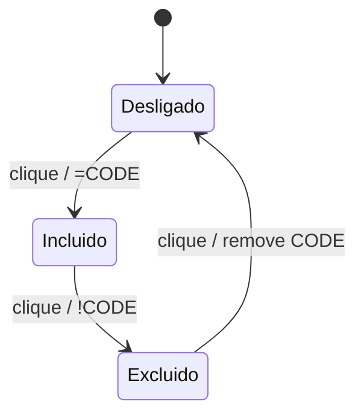
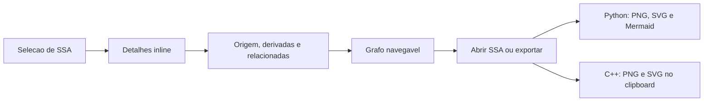
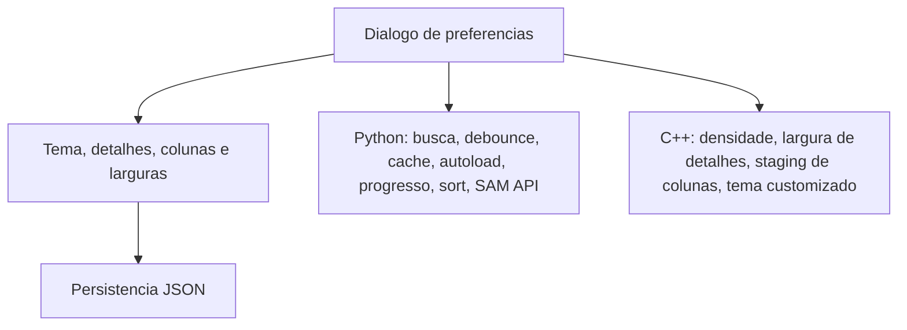

# Diagramas Funcionais Python x C++

Data do levantamento: 2026-07-12

Escopo:

- Python/PyQt6: repositorio irmao `SSA_Consulta_Rapida`, branch `dev`, HEAD observado `d8c4033c`.
- C++/Qt/QML: repositorio atual `SSA_Consulta_Rapida_Cpp`, branch `master`, HEAD usado na consolidacao `ca4e144`.
- Resultado agnostico de linguagem. Nomes de classes e metodos aparecem somente para rastreabilidade.
- Diagramas representam caminhos funcionais principais. Nao substituem testes runtime.

## Arquitetura funcional Python/PyQt6

Rastreio principal:

- Entrada: `main.py::main` -> `gui.launcher::launch_gui` -> `SSAMainWindow`.
- Busca/filtro: `FilterGUISSAMixin::initiate_filtering` -> `FilterWorker::run` -> `core.search_filter`.
- Carga: `gui_workers::load_data` -> `DataLoaderWorker` -> `armazenamento.database`.
- Importacao: selecao/rescan -> `RescanWorker` -> importador -> SQLite -> recarga.
- Encerramento: `SSAMainWindow::closeEvent` -> cancelamento, timers, workers e writer de preferencias.

## Arquitetura funcional C++/Qt/QML

Rastreio principal:

- Entrada: `app/desktop/main.cpp` -> `DesktopApplicationRuntime` -> `Main.qml`.
- Busca/filtro: QML -> `BrowseViewModel`/`FilterPanelViewModel` -> `SsaQueryService` -> `SqliteSsaRepository`.
- Consulta concorrente: `PageQueryCoordinator` aplica latest-wins e cancelamento com `stop_token`.
- Importacao/workflow: `WorkflowCommandViewModel` -> `WorkflowCommandRunner` -> `SsaWorkflowService` -> port.
- Preferencias: QML -> `MainPreferenceFlowCoordinator` -> stores JSON versionados.

## Fluxo comparado de busca e filtros

```mermaid
flowchart TB
    subgraph PY["Python/PyQt6"]
        PY1["Campo, botoes e paineis"] --> PY2["Estado de busca e filtros"]
        PY2 --> PY3["FilterWorker com request id"]
        PY3 --> PY4["Filtros DataFrame e cache"]
        PY4 --> PY5["Paginador e QTableWidget"]
        PY5 --> PY6["Detalhes, derivadas e status"]
    end
    subgraph CPP["C++/Qt/QML"]
        C1["QML: busca, atalhos e cards"] --> C2["Estado canonico nos viewmodels"]
        C2 --> C3["BrowseOrchestrator e latest-wins"]
        C3 --> C4["SQL parametrizado e pagina SQLite"]
        C4 --> C5["SsaTableModel e TableView"]
        C5 --> C6["DetailsViewModel, grafo e status"]
    end
```

Diferenca estrutural relevante: Python carrega e filtra DataFrames em memoria. C++ compila filtros para SQL e mantem somente pagina corrente na tabela.

## Atalho tri-state de situacao exclusivo do C++

Contrato comprovado:

- QML: `PagerQuickFilters.qml`, botao chama `toggleStatusShortcut`.
- Estado: `FilterPanelViewModel::statusShortcutState` retorna 0, 1 ou 2.
- Transicao: `FilterPanelViewModel::toggleStatusShortcut` troca `Equals`, `Different` e ausencia.
- Teste: `PresentationFilterSmokeTest::status_shortcuts_cycle_include_exclude_and_disabled`.
- Python: botoes rapidos sao checkable binarios e o handler monta somente inclusoes. `!` existe em campos textuais, nao no ciclo do botao.

## Fluxo comparado de importacao e manutencao

```mermaid
flowchart TB
    subgraph PY["Python/PyQt6"]
        P1["Menu ou dialogo"] --> P2["RescanProgressDialog"]
        P2 --> P3["RescanWorker"]
        P3 --> P4["Staging, consolidacao e importador"]
        P4 --> P5["SQLite"]
        P5 --> P6["Recarga e feedback"]
    end
    subgraph CPP["C++/Qt/QML"]
        C1["Menu ou FileWorkflowDialogs"] --> C2["WorkflowCommandViewModel"]
        C2 --> C3["WorkflowCommandRunner"]
        C3 --> C4["SsaWorkflowService"]
        C4 --> C5["Import, derivadas ou maintenance port"]
        C5 --> C6["SQLite e resultado explicito"]
        C6 --> C7["Invalidacao, recarga e status"]
    end
```

Python possui consolidacao de entrada e troca de banco pela GUI. C++ possui importacao/rescan modular, mas nao expoe esses dois comandos equivalentes.

## Fluxo comparado de detalhes e derivadas

Ambos suportam navegacao de relacoes e janela dedicada. Cobertura de exportacao difere por formato e por forca dos testes de I/O.

## Fluxo comparado de preferencias

## Familias de funcoes e metodos

| Familia agnostica | Python/PyQt6 | C++/Qt/QML |
| --- | --- | --- |
| Inicializacao | `main`, `launch_gui`, `SSAMainWindow.__init__` | `main`, `DesktopApplicationRuntime`, `DesktopMainViewModelFactory` |
| Busca | `initiate_filtering`, `FilterWorker.run`, `filter_dataframe` | `SearchViewModel::apply`, `SearchParser::parseTerms`, `SsaQueryService::search` |
| Filtros por coluna | `_refresh_after_filter_change`, `column_filter_engine` | `ColumnFilterViewModel`, `TextFilterSqlCompiler` |
| Filtros avancados | `_apply_advanced_filters_from_ui`, `_apply_advanced_filters` | `FilterPanelAdvancedViewModel`, `AdvancedFilterSqlCompiler` |
| Paginacao | `DataPaginator`, `display_current_page` | `BrowseInputCoordinator`, `SqlQueryBuilder` |
| Tabela | `display_current_page`, `on_header_clicked` | `SsaTableModel`, `SsaTable.qml`, `SsaTableColumnManager` |
| Detalhes | `update_details_from_selection`, `gui_details` | `DetailsViewModel`, `DetailsFieldsModel` |
| Derivadas | `derivadas_sync_controller`, `gui_details` | `DerivadasGraphModel`, `SqliteDerivadasPort` |
| Importacao | `RescanWorker`, importador Python | `SpreadsheetImportWorkflowPort`, `SqliteSsaImportWriter` |
| Exportacao | `ListExportWorker`, `GraphExportController` | `ExportViewModel`, `CsvExportPort`, `DerivadasGraph.savePng` |
| Preferencias | `_apply_preferences_dialog_changes`, writer async | `MainPreferenceFlowCoordinator`, `UserPreferencesCoordinator` |
| Encerramento/cancelamento | `closeEvent`, shutdown de workers | `PageQueryCoordinator::cancel`, RAII e QObject ownership |

## Limites da evidencia

- Leitura estatica cobre implementacao e testes existentes, mas nao prova ausencia absoluta.
- Captura Python usou runtime isolado sem banco; valida superficie e layout vazio.
- Captura C++ usou app `build/dev` ja disponivel e banco carregado; valida superficie com dados no macOS.
- Nao houve validacao visual Windows ou Linux nesta rodada.
- Planilha cruzada e relatorio Design Report contem matriz detalhada, referencias e classificacao final.
