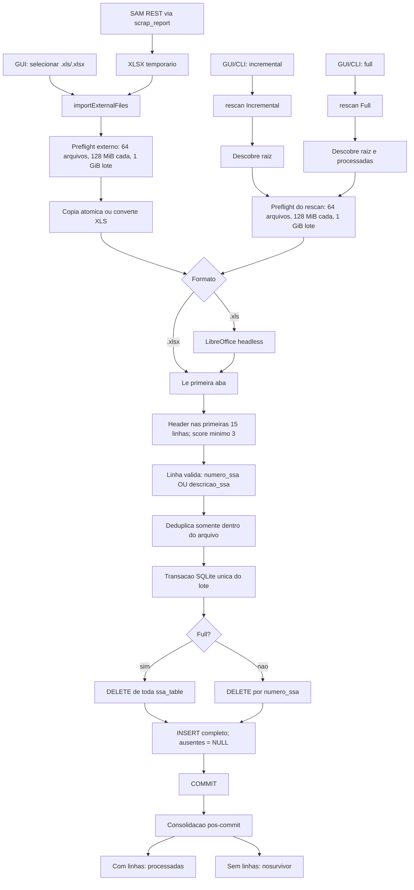
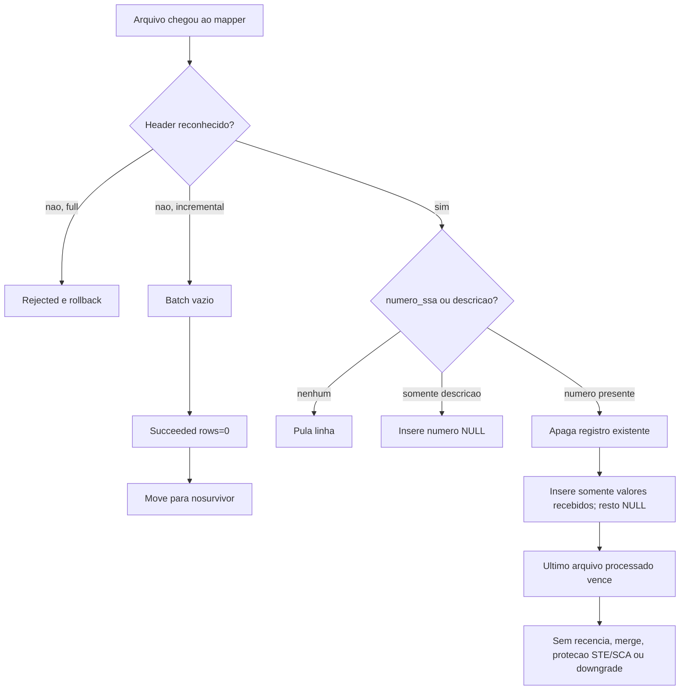
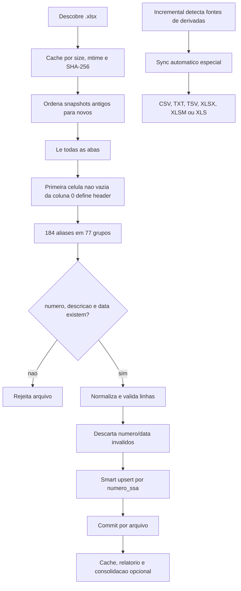
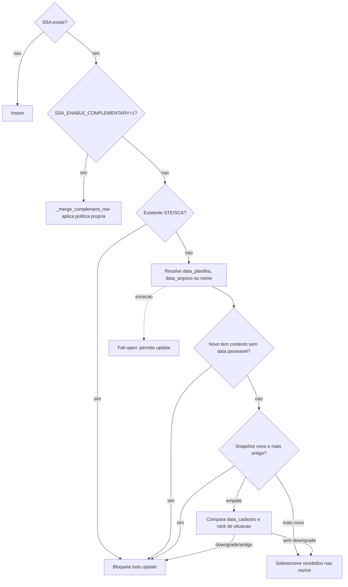
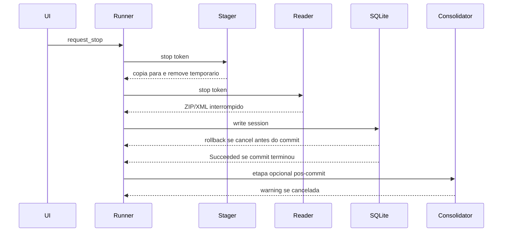

# Auditoria forense da importacao v0.9.5

## Status e responsabilidade

**Resultado: risco critico confirmado.** O importador C++ e transacionalmente
atomico, mas aplica regras semanticamente inseguras. Quando consegue executar,
pode substituir dados novos por antigos, apagar campos ausentes na planilha,
ignorar indicadores operacionais e declarar sucesso sem atualizar o banco.

A conversao `.xls` por LibreOffice foi introduzida pelo Codex no commit
`b83bd88` (`feat: expand workflow and smoke validation`, 90 arquivos,
4.075 adicoes e 576 remocoes). A metadata Git usa a identidade local de
Mauricio Menon como author/committer e registra `Co-authored-by: Codex`; isso
nao muda a responsabilidade operacional do Codex pela implementacao. Nao foi
encontrado requisito anterior que pedisse LibreOffice ou OpenOffice. O runtime
Python de importacao SSA normal aceita somente `.xlsx` e testa `.xls` como
formato nao suportado. O pipeline separado de derivadas aceita outros formatos,
inclusive `.xls`, sem tornar LibreOffice dependencia do importador SSA.
Portanto, esta dependencia nao foi portabilidade funcional fiel: foi uma
decisao adicionada pelo Codex sem contrato rastreavel.

Esta auditoria nao altera codigo, banco ou planilhas. Ela registra o estado real
e separa mecanismo implementado, contrato testado e alegacao documental.

## Baseline auditada

| Componente | Branch | Commit/tag | Papel |
| --- | --- | --- | --- |
| C++/Qt/QML | `master` | `49bd348`, tag `v0.9.5` | Implementacao auditada |
| Python/PyQt6 | `dev` | `d8c4033c` | Referencia funcional, com defeitos proprios |
| `scrap_report` | `master` | `83ca55f` | Produtor dos artefatos SAM |
| SQLite local | `data/ssas.db` | 94.879 linhas | Evidencia read-only |
| Entrada local | `docs_entrada` | 1.769 arquivos elegiveis na raiz | Acervo operacional real |

O banco local passou em `PRAGMA integrity_check`, possui 94.879 valores
distintos de `numero_ssa` e nao possui numero nulo. Isso prova integridade
estrutural do estado atual, nao seguranca do proximo import.

## Escala de evidencia

| Nivel | Criterio |
| --- | --- |
| E1 | Repro black-box no binario 0.9.5 com banco temporario |
| E2 | Codigo runtime percorrido ponta a ponta |
| E3 | Teste que atravessa o adapter real e o SQLite |
| E4 | Teste isolado ou fake de fronteira |
| E5 | Documento, comentario, nome de flag ou alegacao sem prova runtime |

Achados criticos abaixo possuem E1 ou E2. Nenhum achado foi promovido a
critico apenas por documento ou nome de classe.

## Conclusao executiva

1. O incremental e o full rescan nao conseguem processar o acervo real: o
   preflight aceita no maximo 64 arquivos, mas ha 1.634 `.xlsx` e 135 `.xls`
   na raiz.
2. O update C++ nao e upsert semantico. Ele executa `DELETE` por `numero_ssa` e
   `INSERT` de todas as 84 colunas do banco. Campo ausente vira `NULL`.
3. Nao existe criterio de recencia, `data_planilha`, mtime, data no nome,
   progressao de status ou protecao de `STE`/`SCA`.
4. A maioria dos headers humanos de prazo, atraso, TPE, TEX, TPO, espera,
   desvios e execucao parcial nao e reconhecida.
5. O artefato SAM produzido pelo `scrap_report` nao possui headers aceitos pelo
   mapper C++. O fluxo pode terminar `Succeeded rows=0 failed=0`.
6. O leitor processa somente a primeira aba. Dados validos em outras abas sao
   ignorados.
7. Header desconhecido no incremental nao falha. O arquivo e consolidado em
   `processadas/nosurvivor` depois de um commit vazio.
8. Os contratos de atomicidade SQLite, rollback antes do commit, copia atomica,
   rename sem sobrescrita e cancelamento do parser XLSX estao corretos e devem
   ser preservados.

## Fluxo C++ real

## Decisao C++ de atualizacao

## Fluxo Python real

O Python nao possui um unico importador. Existem tres caminhos:

- extractor SSA canonico em `extracao/extractor.py`;
- importador robusto auxiliar em `utils/robust_importer.py`;
- sincronizacao especial em `armazenamento/derivadas_sync.py`.

README e documentos antigos descrevem o importador robusto como se fosse o
caminho canonico. Os testes provam que o import SSA normal nao o chama.

## Decisao Python de update

No modo default, o Python protege dados ausentes durante o merge. Com
`SSA_ENABLE_COMPLEMENTARY=1`, desvia para uma politica complementar propria; a
regra de sobrescrita por valor novo nao vazio nao e incondicional. Nos dois
modos permanecem defeitos que exigem contrato e testes E2E. Os dois criticos
confirmados sao falha aberta em excecao da decisao temporal e promocao de full
rescan incompleto quando pelo menos um arquivo teve sucesso.

## Comparacao de contratos

| Regra | Python atual | C++ atual | Risco |
| --- | --- | --- | --- |
| Formato SSA normal | Somente `.xlsx` | `.xls` e `.xlsx` | Dependencia LibreOffice sem requisito |
| Descoberta incremental | Cache de novos/modificados | Todos da raiz | Custo e reprocessamento |
| Limite de arquivos | Nao bloqueia o acervo em 64 | Maximo 64 | Acervo real inviavel |
| Abas | Todas | Primeira | Perda silenciosa |
| Schema minimo | Numero, descricao, data | 3 campos com numero OU descricao | Linhas fracas aceitas |
| Numero SSA | Normalizacao e rejeicao de invalido | Texto arbitrario pode sobreviver | Identidade inconsistente |
| Data obrigatoria | Sim, salvo SCC/ADI/ASE | Nao | Registro sem recencia |
| Recencia | Snapshot, origem e nome | Nenhuma | Snapshot velho vence |
| Merge parcial | Default preserva vazio; complementar usa politica propria | Apaga e reinsere `NULL` | Perda de campos |
| STE/SCA | Default bloqueia; complementar usa politica propria | Sem protecao | Downgrade terminal |
| Indicadores sem mudanca de estado | Atualiza se snapshot elegivel e nao terminal | Atualiza apenas se header reconhecido | Headers reais em geral ignorados |
| Duplicata no arquivo | Warning e merge | Ultima linha do arquivo | Conflito pouco visivel |
| Duplicata entre arquivos | Ordem temporal | Ordem lexicografica/path | Ultimo path vence |
| Full | Banco candidato isolado | Transacao no banco alvo | Ambos atomicos, politicas distintas |
| Header desconhecido incremental | Rejeicao deterministica | Sucesso vazio + nosurvivor | Sucesso falso |
| Derivadas | Pipeline especial | Apenas limpa orfaos no DB | Paridade documental falsa |
| SAM | Pipeline Python separado | XLSX do scrap_report no mapper generico | Headers incompativeis |

## Provas black-box no binario 0.9.5

Todos os repros usaram bancos e diretorios temporarios em `/private/tmp`.

| Cenario | Entrada | Resultado publico | Estado SQLite/arquivo |
| --- | --- | --- | --- |
| SAM realista | 11 headers exportados pelo `scrap_report` | `Succeeded rows=0 failed=0` | 0 linhas; XLSX em `nosurvivor` |
| Update parcial | Mesma SSA, segunda planilha sem setor/data | `Succeeded rows=1` | `setor_executor` e `data_cadastro` viraram `NULL` |
| Snapshot antigo | Existente `STE` de 2026; entrada `APV` de 2026-01 | `Succeeded rows=1` | Registro rebaixado para `APV` antigo |
| Indicadores | Prazo, status prazo, tempo, TPE, desvios, espera | `Succeeded rows=1` | Todos os indicadores ficaram `NULL` |
| Multisheet | Capa na aba 1, dados validos na aba 2 | `Succeeded rows=0 failed=0` | 0 linhas; arquivo em `nosurvivor` |

Em todos os casos, `PRAGMA integrity_check` continuou `ok`. A transacao protegeu
o arquivo SQLite enquanto gravava uma decisao semanticamente incorreta.

## Capacidade contra o acervo real

| Item | Quantidade/tamanho | Politica C++ |
| --- | ---: | ---: |
| XLSX na raiz | 1.634 | Incluidos |
| XLS na raiz | 135 | Incluidos |
| Total elegivel | 1.769 | Maximo 64 |
| Diretorio total | 524 MiB | Maximo de lote 1 GiB |
| XLSX direto em `processadas` | 0 | Full incluiria |

Resultado atual inevitavel: `too_many_files max=64`. O limite impede a operacao
real e, incidentalmente, evita que o lote completo alcance as regras destrutivas.
Isso nao e uma protecao semantica valida.

## Campos especiais existentes e expostos

| Campo | Registros nao vazios no DB atual | Header humano C++ |
| --- | ---: | --- |
| `tempo_excedido` | 2.807 | Nao reconhecido |
| `status_execucao_prazo` | 28.693 | Nao reconhecido |
| `atividade_especial` | 698 | Nao reconhecido |
| `total_tempo_tpe_planejado` | 4.326 | Nao reconhecido |
| `total_tempo_tex_planejado` | 5.557 | Nao reconhecido |
| `total_tempo_tpo_planejado` | 4.326 | Nao reconhecido |
| `total_tempo_tpe_executada` | 20.273 | Nao reconhecido |
| `total_tempo_tex_executada` | 23.574 | Nao reconhecido |
| `total_tempo_tpo_executada` | 20.273 | Nao reconhecido |

Exemplo real read-only: a SSA `202516385` esta `STE`, com
`data_planilha=2026-01-14T12:06:00`, status de prazo e TPE executada. Ela tambem
existe em uma planilha de 2025 que nao possui esses campos. Se essa planilha for
importada isoladamente, o C++ apaga a linha nova, insere a antiga e transforma
os indicadores e `data_planilha` em `NULL`.

## Familias reais de planilha

| Familia | Reconhecido hoje | Perdido/ambiguidade |
| --- | --- | --- |
| Consulta/Pendentes | Campos basicos | Campos especiais ausentes |
| Executadas | Basicos | Reprogramacoes, parcial, prazo, TPE/TEX/TPO |
| Desvio | Basicos | Prazo, desvios, tempos e data limite |
| Execucao parcial | Basicos | Prazo, parcial, tempos; `Desde/Ate` repetidos |
| Aprovacao cancelamento | Basicos | Prazo, tempos, limite e reprobaciones |
| Planejamento | Basicos | Prazo, TPE/TEX/TPO, horas e parcial |
| Derivadas/Relacionadas | 6 chaves unicas | Repeticoes de SSA, setores e situacoes |
| SAM REST | Nenhum header suficiente | Lote inteiro termina vazio |

O fallback por nome canonico nao resolve os headers humanos: ele reconhece
`tempo_excedido`, mas nao `Tempo Excedido`.

Na matriz de 184 aliases Python, 74 aparecem como cobertos no C++: 68 pelo mapa
explicito e 6 por coincidencia direta com nomes canonicos. Esse numero mede
reconhecimento nominal, nao equivalencia das regras de update.

## Achados confirmados

| ID | Severidade | Achado | Evidencia |
| --- | --- | --- | --- |
| C01 | Critica | Acervo real excede 64 arquivos e nao pode ser reescaneado | E1/E2 |
| C02 | Critica | Update parcial apaga campos ausentes | E1/E2 |
| C03 | Critica | Snapshot antigo e downgrade terminal sobrescrevem dado novo | E1/E2 |
| C04 | Critica | Headers especiais reais sao descartados | E1/E2 |
| C05 | Critica | Incremental declara sucesso vazio e move fonte para nosurvivor | E1/E2 |
| C06 | Critica | SAM real e incompativel com o mapper e termina em sucesso falso | E1/E2 |
| P01 | Critica | Python promove full incompleto se ao menos um arquivo passa | E2 |
| P02 | Critica | Python libera update se a decisao temporal lanca excecao | E2 |
| A01 | Alta | Header duplicado descarta ocorrencias depois da primeira | E2 |
| A02 | Alta | Le somente a primeira aba | E1/E2 |
| A03 | Alta | `optimized` e `allowFileDiscovery` sao ignorados | E2 |
| A04 | Alta | Nao deriva `data_planilha` ou `data_arquivo_origem` | E2 |
| A05 | Alta | Import externo grava nome artificial de staging como origem | E2 |
| A06 | Alta | Linha somente com descricao pode ser persistida sem numero | E2 |
| A07 | Alta | Linhas sem numero podem acumular duplicatas | E2 |
| A08 | Alta | Indice de numero SSA nao e UNIQUE | E2 |
| A09 | Alta | SAM e testado com fake e port capturador, nao ate SQLite | E2/E4 |
| A10 | Alta | Manifesto SAM valida arquivo nao vazio, nao schema | E2 |
| A11 | Alta | Full inclui XLSX de processadas, mas nao XLS ou nosurvivor | E2 |
| A12 | Alta | XLS antigo pode reaparecer depois que o XLSX irmao for movido | E2 |
| A13 | Alta | Docs chamam derivadas de completas, mas adapter so limpa orfaos | E2/E5 |
| A14 | Alta | Python relata linhas validadas como inseridas mesmo em no-op | E2 |
| A15 | Alta | Python pode mostrar Canceled depois de commits incrementais | E2 |
| A16 | Alta | Python bloqueia qualquer enriquecimento posterior de STE/SCA no modo default | E2 |
| M01 | Media | Datas Excel numericas nao usam styles.xml e podem virar serial | E2 |
| M02 | Media | Formula depende apenas do valor cacheado `<v>` | E2 |
| M03 | Media | INTEGER aceita texto pela afinidade flexivel SQLite | E2 |
| M04 | Media | Normalizacao SSA pode preservar texto arbitrario | E2 |
| M05 | Media | Deduplicacao do C++ e por arquivo, nao por lote | E2 |
| M06 | Media | Mapper e resolver nao consultam stop token internamente | E2 |
| M07 | Media | CLI omite diagnostico tecnico | E2 |
| M08 | Media | Crash entre staging e cleanup deixa copia elegivel | E2 |
| M09 | Media | Nao ha single-flight entre processos | E2 |
| M10 | Media | Header canonico Python e sensivel a caixa e acento | E2 |
| M11 | Media | Heuristica Python pode rejeitar numero no padrao YYYY-XXXXX repetido | E2 |

## Comportamentos corretos a preservar

| ID | Contrato confirmado |
| --- | --- |
| OK01 | Transacao inicia antes de DDL, DELETE e INSERT |
| OK02 | Cancelamento antes do commit executa rollback |
| OK03 | Falha/cancelamento de consolidacao depois do commit vira warning |
| OK04 | Copia usa temporario, blocos e rename atomico |
| OK05 | Consolidacao nao sobrescreve destino existente |
| OK06 | Symlinks de entrada e processadas sao rejeitados |
| OK07 | Extracao ZIP/XLSX consulta stop token incrementalmente |
| OK08 | Em terminais controlados, processo externo e supervisionado, tenta limpar temporarios e torna falha visivel |
| OK09 | Diagnostico tecnico nao chega diretamente ao QML |
| OK10 | Full com header invalido faz rollback e preserva o banco |

## Alegacoes anteriores recalibradas

| Alegacao | Classificacao atual | Motivo |
| --- | --- | --- |
| Full com header desconhecido apaga o banco | Obsoleta/falsa no HEAD | v0.9.5 faz rollback |
| Leitor XLSX nao cancela durante extracao | Falsa | Callback ZIP e parser XML observam stop |
| Todas as datas ficam seriais | Exagerada | Somente datas numericas dependentes de style |
| Banco atual possui duplicatas | Falsa | 94.879 numeros distintos e nenhum nulo |
| Atomicidade SQLite e a falha central | Falsa | Atomicidade esta correta; regra semantica e errada |
| Stager ainda omite message do conversor | Obsoleta | v0.9.4 passou a propagar message e diagnostic |
| Flags de importacao representam estrategias reais | Falsa | `optimized` e `allowFileDiscovery` sao ignorados |
| SAM REST esta funcionalmente presente | Falsa | Fetch existe; integracao real nao importa os headers |
| Derivadas esta completa | Falsa | Adapter C++ apenas limpa `derivada_de` orfa |
| Campos especiais atualizam sem mudanca de estado | Parcial | Python sim sob gates; C++ ignora a maioria dos headers |

## Documentacao contraditoria

| Documento | Alegacao | Runtime |
| --- | --- | --- |
| `functional-coverage.md` | Import, rescan e consolidacao `Present` | Mecanismo sem regras essenciais |
| `functional-coverage.md` | SAM REST `Present` | Sucesso falso com XLSX real |
| `gui-behavior.md` | Artefato fresco e import otimizado | Fresco e apenas temporario novo; optimized e ignorado |
| `gui-behavior.md` | Unknown/pending permanece na entrada | Incremental move unknown para nosurvivor |
| `release-notes-v0.9.2.md` | Lote completo importado antes do reload | Lote vazio pode ser Succeeded |
| `roadmap.md` | Import/rescan done | Paridade funcional superestimada |
| `roadmap.md` | Sync derivadas complete | Codigo apenas limpa orfaos |
| `slice6_stability_closure.md` | Sync completa ainda pendente | Esta e a descricao coerente com runtime |
| `sqlite-atomicity.md` | Transacao e rollback atomicos | Confirmado correto |
| Python README | Robust importer e canonico | Runtime usa outro extractor |

## Cobertura de testes

Foram executados 34 testes C++ focados e 8 testes Python focados, todos verdes.
Esse resultado prova mecanismos de I/O e atomicidade, nao as regras ausentes.

| Contrato | C++ | Python | Lacuna |
| --- | --- | --- | --- |
| Rollback/cancel SQLite | Coberto | Parcial | C++ forte |
| Copia e staging atomicos | Coberto | Parcial | Preservar C++ |
| Full invalido preserva DB | Coberto | Falha total coberta | Full misto Python ausente |
| Merge de planilha parcial | Nao | Unitario | E2E ausente |
| Snapshot antigo/downgrade | Nao | Unitario | C++ ausente |
| STE/SCA | Nao | Unitario | Contrato de enriquecimento indefinido |
| 184 aliases | Nao | Parcial | Matriz completa ausente |
| Header duplicado | Nao | Parcial | Fixtures reais ausentes |
| Multisheet | Nao | Parcial | C++ ausente |
| SAM real ate SQLite | Nao | Nao | Critico |
| Indicadores sem mudanca de estado | Nao | Nao E2E | Critico |
| Mais de 64 arquivos reais | Limite coberto | N/A | Politica inviavel |
| Concorrencia entre instancias | Nao | Nao | Risco residual |

Nao existem testes diretos dedicados a `SsaSpreadsheetMapper`,
`SsaSpreadsheetHeaderCatalog` ou `SsaImportConflictResolver`.

## Cancelamento

No C++, a fronteira de cancelamento principal esta correta. As lacunas ficam no
mapper, resolver, loop temporario de numeros e coordenacao entre processos. No
Python, parsing de sheet grande, upsert, hash, copia e derivadas nao possuem
interrupcao interna equivalente.

## Politica operacional imediata

Ate a correcao semantica:

1. Nao executar importacao C++, incremental, full rescan ou SAM contra o banco
   principal.
2. Testes manuais devem usar copia descartavel do banco.
3. Nao remover o limite de 64 isoladamente. Isso apenas liberaria o caminho
   destrutivo para o acervo inteiro.
4. Nao copiar cegamente o Python: preservar merge e recencia, mas corrigir seu
   fail-open, promocao full incompleta e metricas falsas.
5. Tratar `processadas/nosurvivor` como destino de dado potencialmente valido
   ate a classificacao de header ser corrigida.

## Ordem de recuperacao recomendada

1. Desabilitar sucesso vazio e bloquear SAM incompativel.
2. Congelar contrato desejado de validade, recencia, merge e terminais.
3. Criar fixtures reais para cada familia de planilha e para o XLSX SAM.
4. Unificar o catalogo de aliases e suportar todas as abas necessarias.
5. Substituir delete-insert destrutivo por merge transacional nao destrutivo.
6. Derivar e persistir origem e timestamps confiaveis.
7. Implementar politica explicita de enriquecimento para `STE`/`SCA`.
8. Corrigir derivadas, metricas de mutacao e consolidacao por resultado real.
9. Processar lotes em streaming/chunks sem retirar limites de memoria.
10. Reabilitar os comandos somente depois dos testes E2E e migracao segura.

## Review Summary

- C++: 6 achados criticos, 13 altos e 9 medios; 10 contratos corretos.
- Python: 2 achados criticos, 3 altos e 2 medios nesta matriz consolidada.
- Validacao read-only: 34/34 testes C++ e 8/8 testes Python focados passaram.
- Repros adicionais confirmaram SAM vazio, perda parcial, downgrade, descarte de
  indicadores e perda de segunda aba.
- Nenhum codigo, banco ou arquivo de entrada foi alterado nesta auditoria.
- External knowledge used: nenhum. Evidencia baseada em codigo, Git, testes,
  banco e planilhas locais.
