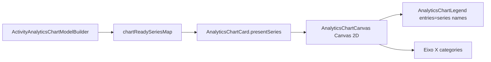

# Plano: Tags on-chart, preset mensal ISO e presets rapidos Executadas por setor

Estou usando **writing-plans** + **systematic-debugging** (evidencia de causa-raiz antes de patch). Spec operacional: integrar com working tree dirty de filtros analytics; **nao** reverter nem conflitar com esse trabalho.

Referencia de qualidade: [`analytics_filtros_harness_27d1cf99.plan.md`](file:///c:/Users/mauri/.cursor/plans/analytics_filtros_harness_27d1cf99.plan.md).

---

## 0. Snapshot git (working tree — verificado)

| Item | Valor |
|------|-------|
| Branch | `master` (trabalhar no branch atual; sem branch novo) |
| Arquivos dirty (9) | Ver tabela abaixo |
| Staged | nenhum |
| HEAD base | `d1be7c7` + trabalho local nao commitado de filtros |

### Arquivos dirty e o que ja contem (integrar, nao reverter)

| Arquivo | Delta aprox. | Conteudo relevante ja presente |
|---------|--------------|--------------------------------|
| `AnalyticsCustomAnalysis.qml` | +194 linhas | `invalidateCustomChart`, `invalidateCustomAnalysis`, `invalidateCustomAnalysisIfActive`, `onPeriodEdited`, YTD button, select-all/limpar, `configureOverdueByArea`/`configureExecutedByPerson`, objectNames analytics |
| `AnalyticsDashboard.qml` | +31 | YTD button, `queueDashboardRefresh` em mudancas de periodo |
| `ActivityAnalyticsViewModel.h/.cpp` | +24 | `clearCustomSeries()`, `yearToDateSelection()` |
| `ActivityAnalyticsTypes.h/.cpp` | +37 | `yearToDateCalendarSelection()` |
| `ActivityAnalyticsViewModelTest.cpp` | +54 | testes YTD, clearCustomSeries |
| `ActivityAnalyticsWindowQmlTest.cpp` | +174 | H1-H6 filtros, select-all, preset width, executedByPerson |
| `ActivityAnalyticsDomainTests.cpp` | +9 | YTD boundary ISO |

**Conclusao:** executor deve **commitar ou preservar** esse trabalho como base E1-filtros antes de tags/presets, ou aplicar este plano **em cima** do diff atual. Nunca reintroduzir `refreshDimensions()` solto onde ja existe `invalidateCustomAnalysis()`.

---

## 1. Levantamento (causa-raiz — evidencia no codigo)

### 1.1 Legenda inutil com series quase zero



| Sintoma | Causa-raiz | Evidencia |
|---------|------------|-----------|
| Legenda nao identifica barras pequenas | Tags existem so para **valores numericos** (`showValueLabels`), nunca para **identidade da serie** | [`AnalyticsChartCanvas.qml`](app/desktop/qml/analytics/AnalyticsChartCanvas.qml) L385-390 (`drawSimpleBars`), L419-424 (`drawStackedBars`) — `fillText(formattedValue(value))` apenas |
| Serie = pessoa com nome completo | `buildCustom` DivisionSectorPerson usa `.name = person` (nome inteiro) | [`ActivityAnalyticsChartModelBuilder.cpp`](src/application/ActivityAnalyticsChartModelBuilder.cpp) L583-586 |
| Serie = dimensao temporal | `.name = seriesName` com `dimensionKey` `"DIV / Pessoa"` | L623-626 |
| Legenda mostra nome longo | `legendEntries()` usa `seriesName(seriesIndex)` sem abreviacao | [`AnalyticsChartCanvas.qml`](app/desktop/qml/analytics/AnalyticsChartCanvas.qml) L222-231 |
| Categorias setor no eixo X ja existem | `wholePeriodCategories` / dashboard `bySector` — problema e **segmento dentro da barra**, nao eixo | Builder L204-214, dashboard L717-730 |

**Contrato QML exposto hoje** (`customSeries` / dashboard keys):

| Campo | Tipo | Origem |
|-------|------|--------|
| `categories` | `QStringList` | `chart.categories` via `stringList()` |
| `series[].name` | `QString` | `chartSeries.name` |
| `series[].values` | `QVariantList` optional doubles | `optionalValues()` |
| `series[].trendValues` | idem | idem |
| `series[].color` | so no QML `presentSeries()` para cohort/deadline | [`AnalyticsChartCard.qml`](app/desktop/qml/analytics/AnalyticsChartCard.qml) L38-54 |

Nao existe campo `tag`/`shortLabel` — **precisa ser adicionado** (C++ builder + VM map + QML canvas).

### 1.2 Mes civil vs mes ISO

| Funcao domain | Semantica | Evidencia |
|---------------|-----------|-----------|
| `calendarMonthPeriod(y,m)` | 1o e ultimo **dia civil** do mes -> faixa ISO weeks | [`ActivityAnalyticsTypes.cpp`](src/domain/ActivityAnalyticsTypes.cpp) L180-194; teste Jul/2026 = W27-W31 [`ActivityAnalyticsDomainTests.cpp`](tests/unit/ActivityAnalyticsDomainTests.cpp) L64-67 |
| `isoReferenceMonth(IsoWeek)` | Mes do **quinta-feira** da semana ISO (`YYYY-MM`) | L120-128; teste W53/2020 -> `2020-12` L35-36 |
| `TimeGrain::IsoReferenceMonth` | Buckets usam `isoReferenceMonth`, nao civil | `analyticsBucketKey` L131-137 |
| `currentMonthSelection()` | **Civil**: `QDate::addMonths(-1)` | [`ActivityAnalyticsViewModel.cpp`](src/presentation/ActivityAnalyticsViewModel.cpp) L506-508 |
| `yearToDateCalendarSelection` | Usa mes ISO de referencia da semana atual | Domain L152-177 |

**Nao existe** `isoReferenceMonthPeriod(year, month)` — obrigatorio adicionar para preset mensal ISO.

Diferenca real (exemplo travado para testes): Jan/2021 civil = W53/2020-W04/2021; mes ISO `2021-01` inclui apenas semanas cujo quinta-feira cai em janeiro/2021 (conjunto diferente).

### 1.3 Executadas vs Emitidas — ordem e default

| Local | Ordem atual | Evidencia |
|-------|-------------|-----------|
| `metricCombo.model` | 0=Cadastradas, 1=Executadas, ... 7=Emitidas | [`AnalyticsCustomAnalysis.qml`](app/desktop/qml/analytics/AnalyticsCustomAnalysis.qml) L532 |
| Enum `AnalyticsMetric` | `Registered=0`, `Executed=1`, `Issued=7` | [`ActivityAnalyticsTypes.h`](src/domain/ActivityAnalyticsTypes.h) L26-36 |
| Dashboard `chartDefinitions` | Cadastradas antes de Executadas; Emitidas perto do fim | [`AnalyticsDashboard.qml`](app/desktop/qml/analytics/AnalyticsDashboard.qml) L25-95 |
| Preset `configureExecutedByPerson` | `metricIndex=1` (Executed) | Custom L325-333 |

**Nao reordenar indices do enum** — combo index == metric int em `requestSelection()` L117-118. Favor Executadas via **default `currentIndex=1`** e **ordem visual no dashboard**, nao permutar array do combo.

### 1.4 Presets rapidos — gap vs existentes

| Preset existente | Configura | Auto `runAnalysis` | Evidencia |
|------------------|-----------|-------------------|-----------|
| `configureOverdueByArea` | metric=8, grain=0, breakdown=1 | **Nao** — so `invalidateCustomAnalysis()` | Custom L315-322 |
| `configureExecutedByPerson` | metric=1, grain=0, breakdown=3, role=2 | **Nao** | L325-333 |
| Teste harness | asserta metric/grain/breakdown + dimension refresh | — | [`ActivityAnalyticsWindowQmlTest.cpp`](tests/smoke/ActivityAnalyticsWindowQmlTest.cpp) L972-987 |

Faltam presets **Executadas por setor / semana ISO atual** e **Executadas por setor / mes ISO completo** com **1 clique = configurar + invalidar + gerar**.

---

## 2. Decisoes travadas (UX + algoritmo — sem opcoes abertas)

### 2.1 Algoritmo de tag

Implementar em **`src/domain/`** (funcao pura, testavel) como `chartSeriesTag(std::string_view seriesName, ChartTagKind kind)` ou duas funcoes `personInitialsTag` / `sectorCodeTag`. QML so consome string pronta via `series[].tag`.

**`personInitialsTag(fullName)`** (ASCII):

1. Trim; split por runs de whitespace (`isspace`).
2. 0 tokens -> `""`.
3. 1 token -> primeira letra `[A-Za-z]`, uppercased, max 1 char. Ex.: `"Maria"` -> `"M"`.
4. 2+ tokens -> 1a letra do token[0] + 1a letra de cada token[1..n], concatenar, uppercase, **cap 4**. Ex.: `"Joao Silva Santos"` -> `"JSS"`.
5. Ignorar caracteres nao-alfabeticos no inicio do token; se token vazio, pular.

**`sectorCodeTag(code)`**:

1. Trim; se vazio -> `""`.
2. Uppercase ASCII; **truncar a 4 chars** (sem ellipsis no canvas). Ex.: `"IEE2"` -> `"IEE2"`, `"SEE"` -> `"SEE"`.

**Resolucao `seriesTag(name)`** (quando builder nao passa kind explicito):

1. Se `name` in `{total, registered_in_period, registered_before_period, registration_unknown, on_time, warning, overdue}` -> tag vazia (cohort/deadline — legenda basta).
2. Se `name` contem `" / "` -> target = ultimo segmento apos split `" / "`.
   - Se target contem espaco -> `personInitialsTag(target)`.
   - Senao -> `sectorCodeTag(target)`.
3. Senao, se `name` contem espaco -> `personInitialsTag(name)`.
4. Senao -> `sectorCodeTag(name)`.

**Categorias eixo X** (nao segmento): manter labels atuais; tags de segmento nao substituem eixo.

### 2.2 Onde renderizar tags

**Canvas 2D dentro `AnalyticsChartCanvas.qml`** — mesmo padrao de `drawSimpleBars` / `drawStackedBars` / value labels. **Nao** usar `Text`/`Shape` overlays separados (evita drift de coordenadas vs hit regions L377-384).

Regras de desenho:

- Propriedade `showSeriesTags: bool` default `true` em `AnalyticsChart` / canvas.
- Desenhar tag **dentro do retangulo do segmento** se `segmentHeight >= 12` OU (`value > 0` e `seriesCount >= 2`).
- Fonte: `Theme.fontSizeCaption - 1`; cor: `Theme.readableText(seriesColor)`.
- Tag substitui value label no segmento quando `formattedValue` caberia mas serie tag e mais util — se ambos cabem (height >= 20), value em cima, tag no meio; se height < 20, **priorizar tag** sobre value numerico.
- `percentStackedBar` e `trendLine`: **sem** series tags (somente bar/stacked quantitativos).

### 2.3 Preset mensal ISO

- Adicionar domain `isoReferenceMonthPeriod(int year, int month)` -> `AnalyticsPeriod{first,last}` cobrindo **todas** semanas ISO cujo `isoReferenceMonth(week) == "YYYY-MM"`.
- Adicionar VM `currentIsoMonthSelection()` -> ultimo **mes ISO de referencia completo** (espelho de `currentMonthSelection`: usar mes ISO da semana atual via `isoReferenceMonth`, retroceder 1 mes civil do par `(year,month)` extraido, depois `isoReferenceMonthPeriod`).
- Adicionar VM `currentIsoWeekSelection()` -> `firstYear/firstWeek == lastYear/lastWeek == semana ISO de hoje`.
- Botao **"Mes ISO completo"** (`objectName: "analyticsCustomIsoMonth"` custom; `"analyticsDashboardIsoMonth"` dashboard) chama selection ISO — **nao** altera navegacao civil existente (combo Janeiro..Dezembro continua civil).

### 2.4 Presets rapidos Executadas por setor

Funcao helper unica em `AnalyticsCustomAnalysis.qml`:

```javascript
function runQuickPreset(configureFn) {
    configureFn()
    root.invalidateCustomAnalysis()
    return root.runAnalysis()
}
```

| objectName | Funcao | metric | grain | breakdown | personRole | Periodo |
|------------|--------|--------|-------|-----------|------------|---------|
| `analyticsExecutedBySectorWeek` | `configureExecutedBySectorWeek` | 1 Executed | 0 WholePeriod | 1 DivisionSector | 2 Executor (default) | `currentIsoWeekSelection()` |
| `analyticsExecutedBySectorMonth` | `configureExecutedBySectorMonth` | 1 | 0 | 1 | 2 | `currentIsoMonthSelection()` |

Cada configure: zera `selectedDivisions/Sectors/People`; set combos; `applyPeriod(...)`.

**Auto-run:** `runQuickPreset` — **LOCK** para todos presets rapidos (incluir retroativamente `configureOverdueByArea` e `configureExecutedByPerson` via `runQuickPreset` nos `onClicked`).

### 2.5 Default metric nova sessao

- `metricCombo.currentIndex: 1` (Executadas) no `Component.onCompleted` de `AnalyticsCustomAnalysis` **somente se** ainda nao houve interacao (nao sobrescrever apos preset).
- Implementacao: property `metricInitialized: false`; onCompleted se !metricInitialized -> index 1 + invalidateCustomAnalysis.

### 2.6 Dashboard — ordem executadas

Reordenar `chartDefinitions` para bloco Executadas **antes** de Cadastradas e **antes** de Emitidas:

1. executedBySector, executedMonthly
2. registeredBySector, registeredMonthly
3. ... demais ...
4. issuedByDivision, issuedMonthly (perto do fim, apos pendentes)

Sem alterar keys nem backend.

---

## 3. Nao fazer

- Nao reordenar indices do enum `AnalyticsMetric` nem permutar `metricCombo.model` (quebra `requestSelection`).
- Nao substituir navegacao civil de mes por ISO (somente **preset** dedicado).
- Nao remover legenda (`AnalyticsChartLegend` permanece).
- Nao auto-run no custom fora dos botoes preset (periodo manual continua exigindo "Gerar grafico").
- Nao reverter dirty de filtros (clearCustomSeries, YTD, select-all, invalidateCustomAnalysis).
- Nao criar branch/PR/commit sem autorizacao explicita.
- Nao mudar layout de cards além de botoes preset na faixa de acoes existente.
- Nao portar logica de tag para SQL/domain analytics query.

---

## 4. Inventario arquivos minimos

| Acao | Arquivo | Motivo |
|------|---------|--------|
| Modificar | `src/domain/ActivityAnalyticsTypes.h` | declarar `isoReferenceMonthPeriod`, `personInitialsTag`, `sectorCodeTag`, `chartSeriesTag` |
| Modificar | `src/domain/ActivityAnalyticsTypes.cpp` | implementacao |
| Modificar | `src/application/ActivityAnalyticsChartModelBuilder.h` | campo `std::string tag` em `AnalyticsChartSeries` |
| Modificar | `src/application/ActivityAnalyticsChartModelBuilder.cpp` | preencher tag ao push series |
| Modificar | `src/presentation/ActivityAnalyticsViewModel.h/.cpp` | `currentIsoWeekSelection`, `currentIsoMonthSelection`; propagar `tag` em `chartReadySeriesMap` L84-89 |
| Modificar | `app/desktop/qml/analytics/AnalyticsChartCanvas.qml` | desenhar tags |
| Modificar | `app/desktop/qml/analytics/AnalyticsChart.qml` | prop `showSeriesTags` |
| Modificar | `app/desktop/qml/analytics/AnalyticsChartCard.qml` | repassar `series[].tag` em `presentSeries` |
| Modificar | `app/desktop/qml/analytics/AnalyticsCustomAnalysis.qml` | presets, Mes ISO, default metric, runQuickPreset |
| Modificar | `app/desktop/qml/analytics/AnalyticsDashboard.qml` | Mes ISO + reorder chartDefinitions |
| Modificar | `tests/unit/ActivityAnalyticsDomainTests.cpp` | iso month period + tag algorithm |
| Modificar | `tests/unit/ActivityAnalyticsChartModelBuilderTests.cpp` | tag preenchido em series person |
| Modificar | `tests/smoke/ActivityAnalyticsViewModelTest.cpp` | ISO week/month selections |
| Modificar | `tests/smoke/ActivityAnalyticsWindowQmlTest.cpp` | T4-T7 presets + regressao H1-H6 |
| Modificar | `app/desktop/qml/analytics/tst_AnalyticsCharts.qml` | T1 tag render contract |
| **Nao** | CMakeLists, SQL builder, ActivityAnalyticsService | sem mudanca de contrato de query |

Total: **15 arquivos** (14 se E5 dashboard Mes ISO for considerado opcional — **nao e**, incluir).

---

## 5. Fase L — Harness RED (antes de producao)

**Skill:** `systematic-debugging` + TDD. **Subagente:** `test-automator`.

### L1. Casos RED novos (devem falhar antes do fix)

| ID | Suite | Caso | Assert pos-fix |
|----|-------|------|----------------|
| T1 | `tst_AnalyticsCharts.qml` | stackedBar 4 series, valores [1,0,0,0] | apos paint+API, `chartCanvas` expoe helper test `seriesTagAt(0,0)` == tag esperada OU screenshot property `tagPainted` |
| T2 | `ActivityAnalyticsDomainTests.cpp` | `personInitialsTag("Joao Silva Santos")` | `"JSS"` |
| T2b | idem | `personInitialsTag("Maria")` | `"M"` |
| T3 | idem | `isoReferenceMonthPeriod(2021,1)` vs `calendarMonthPeriod(2021,1)` | periodos **diferentes** (W53/2020 start vs ISO-Jan set) |
| T4 | `ActivityAnalyticsWindowQmlTest.cpp` | click `analyticsExecutedBySectorWeek` | `metricIndex==1`, `breakdownIndex==1`, `customRequestCount>=1`, weeks first==last==current |
| T5 | idem | click `analyticsExecutedBySectorMonth` | period bate `currentIsoMonthSelection()`, request disparado |
| T6 | idem | fresh custom tab | `metricIndex==1` (Executadas default) |
| T7 | idem | `configureExecutedByPerson` via preset | `customRequestCount>=1` (auto-run) |
| T8 | `ActivityAnalyticsChartModelBuilderTests.cpp` | DivisionSectorPerson chart | `series[i].tag` non-empty para pessoa |
| T9 | `ActivityAnalyticsViewModelTest.cpp` | `currentIsoWeekSelection` | firstWeek==lastWeek==QDate::weekNumber |
| T10 | regressao | H1-H6 filtros (working tree) | permanecem verdes |

**Nota T1:** preferir expor funcao QML `tagTextFor(seriesIndex)` espelhando domain para teste sem OCR de screenshot.

### L2. Comandos harness

**Windows (MSVC preset local do usuario):**

```text
cmake --preset dev
cmake --build build/windows/amd64/msvc/msvc2022_64/dev --target ssa_qml_activity_analytics_tests ssa_presentation_smoke_tests
ctest --test-dir build/windows/amd64/msvc/msvc2022_64/dev -R "ActivityAnalytics|AnalyticsCharts" --output-on-failure
```

**WSL / canonico AGENTS:**

```text
cmake --preset dev
cmake --build --preset dev --target ssa_qml_activity_analytics_tests
ctest --preset dev -R "ActivityAnalytics|AnalyticsCharts" --output-on-failure
```

**Criterio saida Fase L:** T1-T10 escritos; novos casos **falham** com mensagem clara; H1-H6 ainda verdes no diff atual.

---

## 6. Fase E — Execucao arquivo a arquivo

**Skill:** TDD + `subagent-driven-development`. Ordem obrigatoria:

### E1. Domain — mes ISO + tags

**Arquivos:** [`ActivityAnalyticsTypes.h/.cpp`](src/domain/ActivityAnalyticsTypes.h)

**API exata:**

```cpp
[[nodiscard]] AnalyticsPeriod isoReferenceMonthPeriod(int yearValue, int monthValue);
[[nodiscard]] std::string personInitialsTag(std::string_view fullName);
[[nodiscard]] std::string sectorCodeTag(std::string_view sectorCode);
[[nodiscard]] std::string chartSeriesTag(std::string_view seriesName);
```

**`isoReferenceMonthPeriod` algoritmo:**

1. Validar year/month.
2. Bounds: `calendarMonthPeriod(year,month)` fornece janela de busca ampla (first.week .. last.week iterate com `nextIsoWeek`).
3. Coletar semanas onde `isoReferenceMonth(week) == format(year,month)`.
4. Se vazio -> `invalid_argument`.
5. Retornar `{first=min, last=max}`.

**Testes:** T2, T2b, T3.

**Commit atomico (quando autorizado):** `feat(analytics): iso reference month period and chart series tags`

---

### E2. Chart builder + ViewModel selections

**Arquivos:** [`ActivityAnalyticsChartModelBuilder.h/.cpp`](src/application/ActivityAnalyticsChartModelBuilder.h), [`ActivityAnalyticsViewModel.h/.cpp`](src/presentation/ActivityAnalyticsViewModel.cpp)

**Builder:** ao criar cada `AnalyticsChartSeries`, set `.tag = domain::chartSeriesTag(name)` (vazio para cohort/deadline names).

**VM — novos metodos Q_INVOKABLE:**

```cpp
Q_INVOKABLE QVariantMap currentIsoWeekSelection() const;
Q_INVOKABLE QVariantMap currentIsoMonthSelection() const;
```

**`currentIsoWeekSelection`:** `isoWeekForDate(today)` -> first=last.

**`currentIsoMonthSelection`:** extrair `(y,m)` de `isoReferenceMonth(currentWeek)`; retroceder 1 mes (Janeiro -> Dezembro ano-1); `isoReferenceMonthPeriod(y,m)`; mapa igual `calendarMonthMap` (year, month, firstYear, firstWeek, lastYear, lastWeek).

**`chartReadySeriesMap`:** adicionar `{QStringLiteral("tag"), QString::fromStdString(chartSeries.tag)}` no mapa de serie L84-89.

**Testes:** T8, T9.

---

### E3. Canvas — desenhar tags

**Arquivos:** [`AnalyticsChartCanvas.qml`](app/desktop/qml/analytics/AnalyticsChartCanvas.qml), [`AnalyticsChart.qml`](app/desktop/qml/analytics/AnalyticsChart.qml), [`AnalyticsChartCard.qml`](app/desktop/qml/analytics/AnalyticsChartCard.qml)

**Mudancas:**

1. `seriesAt(i).tag` fallback `chartSeriesTag(name)` se tag ausente (compat dashboard antigo em memoria).
2. `function seriesTag(seriesIndex)` no canvas.
3. Em `drawSimpleBars` / `drawStackedBars`, apos `fillRect`, desenhar tag conforme secao 2.2.
4. `presentSeries()` inclui `"tag": item.tag || ""`.

**Testes:** T1.

---

### E4. Custom analysis — presets + default

**Arquivo:** [`AnalyticsCustomAnalysis.qml`](app/desktop/qml/analytics/AnalyticsCustomAnalysis.qml)

**Integracao dirty tree:**

- Preservar `invalidateCustomAnalysis*` — presets chamam essa cadeia, nunca `refreshDimensions` direto.
- Preservar select-all / YTD / objectNames existentes.

**Adicionar:**

```javascript
function configureExecutedBySectorWeek() {
    metricCombo.currentIndex = 1
    grainCombo.currentIndex = 0
    breakdownCombo.currentIndex = 1
    roleCombo.currentIndex = 2
    root.selectedDivisions = []
    root.selectedSectors = []
    root.selectedPeople = []
    root.applyPeriod(root.analyticsViewModel.currentIsoWeekSelection())
}

function configureExecutedBySectorMonth() {
    // idem period = currentIsoMonthSelection()
}

function applyIsoMonth() {
    root.applyPeriod(root.analyticsViewModel.currentIsoMonthSelection())
}

function runQuickPreset(configureFn) {
    configureFn()
    root.invalidateCustomAnalysis()
    return root.runAnalysis()
}
```

**Botoes** (mesma `RowLayout` L571-628):

| objectName | text | onClicked |
|------------|------|-----------|
| `analyticsCustomIsoMonth` | `Mes ISO completo` | `applyIsoMonth()` (nao auto-run) |
| `analyticsExecutedBySectorWeek` | `Executadas/setor semana` | `runQuickPreset(configureExecutedBySectorWeek)` |
| `analyticsExecutedBySectorMonth` | `Executadas/setor mes ISO` | `runQuickPreset(configureExecutedBySectorMonth)` |

**Atualizar** `analyticsOverdueByArea` e `analyticsExecutedByPerson` -> `runQuickPreset(...)`.

**Default metric:** ver 2.5.

**Testes:** T4-T7, T6.

---

### E5. Dashboard — ordem + Mes ISO

**Arquivo:** [`AnalyticsDashboard.qml`](app/desktop/qml/analytics/AnalyticsDashboard.qml)

- Reordenar `chartDefinitions` (secao 2.6).
- Botao `analyticsDashboardIsoMonth` -> `applyPeriod(analyticsViewModel.currentIsoMonthSelection())` + `queueDashboardRefresh()`.

---

### E6. Validacao final

```text
cmake --build --preset dev
ctest --preset dev -R "ActivityAnalytics|AnalyticsCharts" --output-on-failure
cmake --build --preset dev --target all_qmllint
bash -o pipefail -c 'qmlformat "$1" | diff -u "$1" -' -- app/desktop/qml/analytics/AnalyticsChartCanvas.qml
bash -o pipefail -c 'qmlformat "$1" | diff -u "$1" -' -- app/desktop/qml/analytics/AnalyticsCustomAnalysis.qml
clang-format --dry-run --Werror src/domain/ActivityAnalyticsTypes.cpp src/presentation/ActivityAnalyticsViewModel.cpp
pre-commit run cppcheck --hook-stage manual --files src/domain/ActivityAnalyticsTypes.cpp src/application/ActivityAnalyticsChartModelBuilder.cpp
aikido-scan (skill) nos arquivos C++/QML tocados
```

Windows path alternativo conforme secao L2.

---

## 7. Matriz skills / subagentes

| Fase | Skill | Subagente | Entrega |
|------|-------|-----------|---------|
| L | `systematic-debugging` | `test-automator` | T1-T10 RED |
| E1 | TDD | `cpp-pro` | domain ISO + tags |
| E2 | TDD | `cpp-pro` | builder + VM |
| E3 | `qt-qml` | `frontend-developer` | canvas tags |
| E4-E5 | `qt-qml` | `frontend-developer` | presets QML |
| Review | requesting-code-review | `code-reviewer` | pos cada E* |
| Debug | systematic-debugging | `debugger` | se harness flake |
| Close | AGENTS + aikido | orquestrador | report slice |

---

## 8. Matriz de aceite

| # | Requisito | Evidencia | Fase |
|---|-----------|-----------|------|
| A1 | Legenda mantida | `AnalyticsChartLegend` visible unchanged | E3 |
| A2 | Tags on-chart com iniciais pessoa | T2 + T1 | E1,E3 |
| A3 | Tags setor trunc 4 chars | sectorCodeTag tests + stacked sector chart | E1,E3 |
| A4 | Preset Mes ISO completo | T3 + botoes analyticsCustomIsoMonth | E1,E4 |
| A5 | Mes ISO != mes civil em fronteira | T3 domain | E1 |
| A6 | Executadas default metric | T6 | E4 |
| A7 | Dashboard executadas antes emitidas | chartDefinitions order + visual | E5 |
| A8 | Preset semana executadas/setor 1 clique | T4 | E4 |
| A9 | Preset mes ISO executadas/setor 1 clique | T5 | E4 |
| A10 | Presets antigos auto-run | T7 | E4 |
| A11 | Filtros dirty integrados | H1-H6 verdes T10 | E4 |
| A12 | Sem regressao charts | tst_AnalyticsCharts + builder tests | E6 |

---

## 9. Confidence check

| Area | Confianca | Risco residual |
|------|-----------|----------------|
| Algoritmo tag domain | Alta | Nomes com particulas multiplas ("da Silva") — aceitar regra literal 4 chars |
| isoReferenceMonthPeriod | Alta | Validar Jan/2021 e Jul/2026 com testes golden |
| Canvas tags legibilidade | Media | Segmentos <12px sem tag — aceitavel; tooltip permanece |
| Auto-run presets | Alta | `canAnalyze` true pois breakdown DivisionSector nao exige people |
| Integracao dirty tree | Alta | Conflito so se executor reverte invalidate* — proibido |
| Layout botoes | Media | Largura 1180 — estender teste width minimo para 2 novos botoes |

**Loop 100%:** apos E6, reexecutar T1-T10 + H1-H6 + inspecao visual offscreen (`QT_QPA_PLATFORM=offscreen`) em chart multi-serie com dados fake do harness.

---

## 10. Proxima atividade apos aprovacao

1. Confirmar working tree filtros commitado ou mantido como base.
2. Escrever T1-T10 RED (Fase L) sem alterar producao alem do necessario para compilar testes.
3. E1 domain -> E2 VM/builder -> E3 canvas -> E4 custom -> E5 dashboard -> E6 validate.
4. Nao misturar com wizard Configurar Dados.
